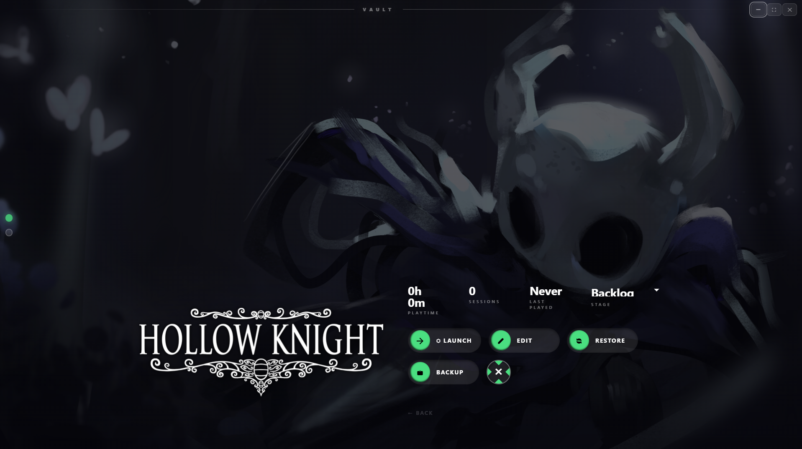
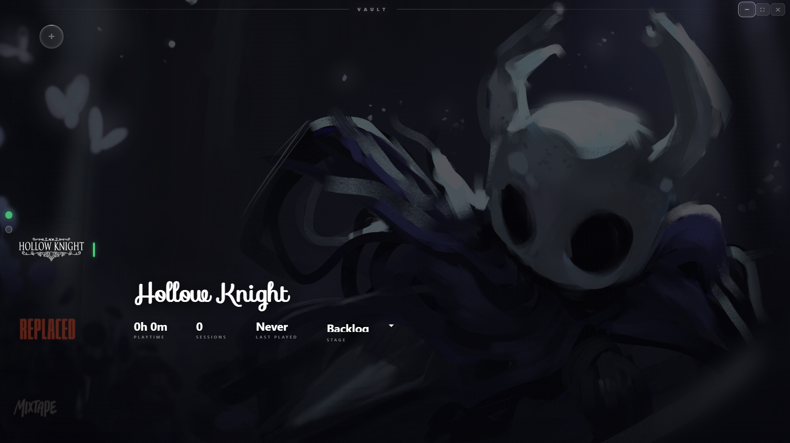

<p align="center">
  
</p>

<h1 align="center">SILO</h1>

<p align="center">
  A game launcher for Windows. Controller-first, no frills, keeps your saves safe.
</p>

<p align="center">
  <a href="https://github.com/antnjhn/vault-launcher/releases/latest">
    
  </a>
  
  
  
</p>

<p align="center">
  
  
</p>

---

SILO is a personal game launcher built for people who want something that feels like a console dashboard on a PC. Navigate with a controller, set up your library however you want, and never think about saves again.

---

## What it does

**Controller navigation** — Full gamepad support with Xbox button layout. Browse and launch everything without touching a keyboard.

**Per-game backgrounds and cover art** — Custom background images that crossfade during navigation. Import logos and customize typography per game.

**Playtime tracking** — Tracks session count, total hours, and last played date. Stored locally, nothing sent anywhere.

**Save management** — Detects save locations on first launch and backs them up automatically when you close a game. Manual backups are one click. Restoring is just picking from a list.

**State detection** — Games gray out if their executable is no longer found on disk.

**Uninstaller integration** — Detects `unins000.exe` and lets you uninstall directly from the launcher.

**Frameless fullscreen UI** — No window chrome, no taskbar bleed. Fills the screen and gets out of the way.

---

## Planned

- [ ] Linux support (via AppImage / .deb)
- [ ] Cloud save sync (Google Drive / OneDrive)
- [ ] Multi-monitor support
- [ ] Auto-update on launch

---

## Installation

Download the latest build from the [Releases](https://github.com/antnjhn/vault-launcher/releases/latest) page.

| File | Type |
|------|------|
| `vault-launcher_0.1.0_x64-setup.exe` | NSIS installer |
| `vault-launcher_0.1.0_x64_en-US.msi` | MSI installer |
> Windows may show a SmartScreen warning since the binary is unsigned. Click **More info** then **Run anyway**. This is expected for indie software without a code signing certificate.

---

## Build from source

**Prerequisites:** Node.js (LTS), Rust, Windows 10 or 11.

```bash
git clone https://github.com/antnjhn/vault-launcher.git
cd vault-launcher
npm install
npm run build
```

Compiled binaries output to `src-tauri/target/release/bundle/`.

---

## Save management

Save locations are detected automatically when you add a game. From the details panel:

| Action | What it does |
|--------|--------------|
| `BACKUP` | Takes a named snapshot of the current save state |
| `RESTORE` | Lists available backups labeled `AUTO` or `MANUAL` — pick one to restore or delete |

Automatic backups run every time a game exits.

---

## Data storage

Everything stays local. Nothing leaves your machine.

```
%APPDATA%\com.vault.launcher\
├── games.json       # library metadata
├── wallpapers/      # background images
└── backups/         # compressed save snapshots
```

---

## Stack

| Layer | Technology |
|-------|------------|
| Shell | [Tauri 2](https://v2.tauri.app/) |
| Backend | Rust — process management and filesystem ops |
| Frontend | Vanilla HTML / CSS / JS |

---

## License

[](LICENSE)

MIT. Do whatever you want with it.
